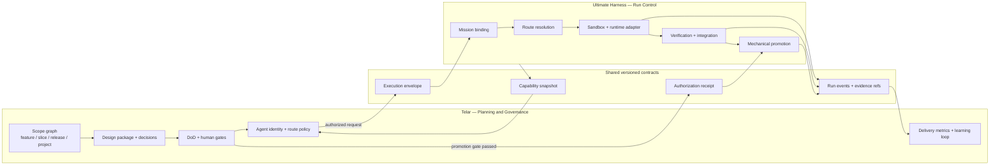

# Telar and Ultimate Harness boundary

> **Status:** architecture proposal; no schema or runtime change is authorized by this document.
> **Evidence basis:** repository state at `74b9ee1` on 2026-08-23. “Implemented” below means a code path and focused tests exist at that revision; documentation-only intent is not counted as implementation.

> **Canonical cross-project decision:**
> `Telar/docs/architecture/adrs/ADR-023-separate-delivery-systems-behind-contracts.md`
> adopts the separate-product boundary and defers a shared package until the
> observable extraction gate passes. This document remains the UH evidence and
> Run Control mapping; ADR-023 controls cross-project ownership if they differ.

## Recommendation

Keep Telar and Ultimate Harness as separate products for now, connected through a small, versioned Run Control contract.

- **Telar should own planning and governance:** scope graphs, independent decisions, design packages, human gates, agent identity, quality policy, Definition of Done, delivery metrics, and the learning loop.
- **Ultimate Harness should own mission execution:** runtime discovery and dispatch, sandbox lifecycle, attempt records, cancellation, diff and output capture, verification command execution, team integration, and mechanical promotion.
- **A shared contracts module should own only the wire vocabulary:** execution envelopes, capability snapshots, run/event/evidence references, route explanations, and promotion authorization receipts.

This preserves one execution controller per attempt. Telar can state *what is authorized and what quality bar applies*; UH remains the only component that starts, retries, falls back, cancels, verifies, or promotes that attempt.

The recommendation is intentionally not a merge recommendation. UH already has meaningful execution depth, while Telar's proposed depth is predominantly upstream governance. Folding either domain into the other now would blur ownership before the inter-product contract has been exercised.

## Evidence and classification

The inventory uses three classifications:

| Classification | Meaning |
|---|---|
| Implemented | Persisted contract or executable behavior exists and has focused tests. |
| Partial | A useful primitive exists, but it does not satisfy the complete Telar requirement or is only advisory. |
| Not implemented | No durable contract and no executable behavior were found. Documentation intent alone does not qualify. |

The principal evidence is the code under [`src/schema/`](../../src/schema/), [`src/harness/`](../../src/harness/), [`src/adapters/`](../../src/adapters/), and the corresponding [`tests/`](../../tests/). Roadmap or architecture statements are treated as context when code does not substantiate them.

## Current Ultimate Harness architecture

### Modules and ownership

| Layer | Current modules | Implemented responsibility | Public seam today |
|---|---|---|---|
| Persisted contracts | `src/schema/project.ts`, `workflow.ts`, `mission.ts`, `artifacts.ts`, `runs.ts`, `adapter.ts`, `adapter-capabilities.ts` | Zod validation for projects, workflows, missions, adapters, runs, runtime results, verification, promotion, sandboxes, skills, and coarse capability/cost classes. | Schema validators and inferred TypeScript types. |
| Mission compilation | `src/harness/mission.ts`, `propose.ts`, `spec-loader.ts`, `spec-templates.ts`, `test-scaffold.ts` | Creates or proposes mission packets, compiles a constrained `uh.spec.v0` document into a mission, and scaffolds test placeholders from acceptance criteria. | Function exports plus `uh mission create`, `uh mission propose`, and `uh spec scaffold`. |
| Prompt boundary | `src/harness/dispatch-context.ts`, `render-prompt.ts`, `runtime-final-message.ts` | Builds one normalized dispatch context and renders the exact prompt persisted for an attempt. | `DispatchContext`, `buildDispatchContext`, and `renderPrompt`. |
| Runtime discovery | `src/harness/registry.ts`, `capabilities.ts`, `runtime-requirements.ts` | Loads adapter manifests, checks availability, validates declared capabilities, and rejects incompatible missions. | `RuntimeRegistry` covers list/load/check only; it does not expose execution. |
| Routing and cost | `src/harness/auto-route.ts`, `cost-table.ts`, `cost-forecast.ts`, `usage.ts` | Deterministic cheapest-eligible selection using tools, context window, and coarse cost class; token history and heuristic cost forecasts. | Pure route/forecast functions and CLI commands. |
| Run orchestration | `src/cli.ts`, adapter modules, `run-id.ts`, `runtime-events.ts`, `mission-cancel.ts` | Dispatch, per-run directories, status transitions, cancellation events, result normalization, and artifact capture. | An internal `RuntimeWiring { dryRun, run, surfaceBlocked }` table in `src/cli.ts`; there is no stable product-level Run Control interface. |
| Multi-runtime execution | `src/harness/run-all.ts`, `team-run.ts`, `workflow.ts` | Cross-runtime fan-out and diff comparison; worker worktrees plus leader merge/integration; staged Plan→PRD→Execute→Verify→Fix with a bounded fix loop. | Injected runner/ops interfaces used primarily inside the process and tests. |
| Verification and promotion | `src/harness/verify.ts`, `spec-judge.ts`, `verdict.ts`, `promote.ts` | Runs commands and acceptance checks, records one optional LLM adherence judgment, captures manual verdicts, and blocks promotion until verification passes. | CLI and function exports; declared mission `review_gates` are not an executable gate engine. |
| Isolation and evidence | `src/harness/sandbox.ts`, `sandbox-backends.ts`, `diff-capture.ts`, artifact helpers | Git-worktree/directory/container-backed execution boundaries and per-attempt prompt, logs, events, diff, result, and latest/history pointers. | Sandbox/backend functions and filesystem artifacts under `.harness/`. |
| Human surfaces | `src/tui/`, `apps/hermes-plugin/` | Reads mission/run state, presents execution status, events, replay/cancel affordances, and plugin views. | Consumers of CLI-safe primitives and `.harness/` artifacts; they do not define new lifecycle contracts. |
| Optional memory and telemetry | `src/extensions/honcho-memory/`, `src/harness/telemetry.ts` | Runtime prompt enrichment/exchange memory and opt-in sanitized CLI outcome telemetry. | Optional extension/config seams; neither is a governance learning loop. |

### Adapter seam

Seven adapter IDs are wired: `hermes`, `codex`, `hermes-proxy`, `openrouter`, `pi`, `oh-my-pi`, and experimental `anthropic`. They fall into three execution families:

| Family | Adapters | Current shape |
|---|---|---|
| Local CLI agents | `hermes`, `codex`, `pi`, `oh-my-pi` | Each exports runtime-specific check/dry-run/plan/run/collect functions, runner injection types, strict runtime config, diff capture, and result collection. |
| HTTP model transports | `hermes-proxy`, `openrouter`, `anthropic` | Each exports analogous plan/run/collect functions around an HTTP request/stream, with credentials outside artifacts. These transports do not supply local filesystem tools themselves. |
| Capability manifests | all seven | Static tool flags, sandbox class, maximum context, cost class, override/cancel/replay support. Hermes Proxy also has a live capability probe, but the general router consumes the static manifest. |

The adapter implementations are behaviorally similar but do not implement one exported execution interface. Execution polymorphism currently exists only in the private `RUNTIME_WIRINGS` table in `src/cli.ts`; `RuntimeRegistry` handles manifest availability, not launch/observe/collect. This is the most important seam to formalize for Telar. Telar should not import seven adapter modules or parse adapter-specific output.

## Capability inventory against the Telar design

| Desired Telar capability | Status in UH | Code-backed evidence | Missing part |
|---|---|---|---|
| Explicit `feature` / `slice` / `release` / `project` scopes | Not implemented | UH persists a `Project`, a flat `Mission`, and feature/epic spec templates. | No typed scope kind, parent/child scope graph, release aggregation, or scope-level lifecycle. |
| Independent decisions | Partial | Optional `design.md` scaffolds free-form decisions/alternatives; runtime verdict and promotion decision are persisted. | No decision entity with stable ID, status, owner, evidence, dependencies, or independent approval lifecycle. |
| Human gates | Partial | Promotion normally requires passed `verification.yaml` plus `approved_by`; rejection/deferral are persisted. | `verification.review_gates[]` is stored but not executed. `auto-on-verify` can intentionally bypass a human promotion step. There is no reusable ordered gate engine. |
| Mandatory design packages and diagrams | Partial | `uh mission create --design` can create `design.md`; validation warns when acceptance criteria exist without it. | Design is optional, absence is non-blocking, content is not schema-validated, and diagrams are neither declared nor checked. |
| Routing by quality, cost, latency, quota, subscription, and API | Partial | Auto-route filters tool/context/cost requirements, chooses the cheapest eligible static adapter, explains the choice, and can forecast coarse token cost. Some adapters detect quota errors. | No quality score/floor, measured latency, live quota/budget, subscription-vs-API policy, dynamic price/model capability record, or policy-driven retry/fallback. Quota detection terminates or blocks rather than rerouting. |
| Agent identity separate from actual model, with fallbacks | Partial | Team workers have a `role` distinct from `adapter`; missions can override adapter model configuration. | No durable agent identity/profile, per-agent model binding, attempt-level resolved-model record, or fallback chain. Team worker records bind role directly to adapter and do not carry independent model policy. |
| Ledger of instructions, model, context, decisions, tests, and evidence | Partial | Mission packet, rendered `prompt.md`, session command/args, events, logs, diff, runtime result, verification, promotion, verdict, and per-run history are persisted. | No single normalized/hash-linked ledger. The actual resolved model is not guaranteed in the runtime-session/result contract; decisions are fragmented; project and mission audit shapes are not one enforced schema. |
| Triage, user stories, and programmatic Definition of Done | Partial | `uh.spec.v0` captures goal/non-goals/acceptance criteria; spec-to-mission and test scaffolding exist; AC commands can block verification. | No intake/triage model, user-story contract, prioritization, dependency graph, or first-class DoD object. Spec-derived ACs initially lack executable commands until another step supplies them. |
| TDD `RED → minimum → GREEN → refactor` | Partial | Opt-in TDD verification blocks source-only diffs and test scaffolding generates one placeholder per AC. | The gate proves only that a final diff touching source also touches tests. It records no temporal RED, minimum implementation, GREEN, or refactor checkpoints and cannot prove tests failed before code. |
| Multi-model reviews | Partial | `run-all` compares diffs from multiple runtimes; one LLM spec-adherence judge can grade a spec plus diff; team execution supports multiple adapters. | Comparison is not a review quorum. The judge is single-shot, with no independent multi-model votes, disagreement/adjudication, or review policy artifact. |
| Integrator | Implemented, bounded | Team runs create worker worktrees, a leader merge branch, integration report, conflict/failure states, partial-success semantics, and verification over the integrated result. | Only merge-based integration is accepted; integrator identity/model policy and governance authority are not independent contracts. |
| Minimal-context judge | Not implemented | The existing judge receives the spec goal, all ACs, and the supplied complete diff. | No context selector, budget, provenance/exclusion record, sealed evidence view, or judge-isolation policy. |
| Delivery metrics | Partial | Runs carry timestamps/status; events carry duration and token usage; cost forecast and sanitized command telemetry exist. | No feature-to-release lead time, cycle time, rework, review latency, defect escape, throughput, or quality/cost/latency rollups by scope/agent/route. |
| Learning loop | Partial | Honcho can enrich prompts and remember/search exchanges; run history provides raw observations. | No governed hypothesis→change→measurement→adoption loop, routing-policy update, decision follow-up, or regression guard tied to delivery outcomes. |

## Boundary and duplication rules

Several concepts would otherwise be implemented twice. The ownership boundary should be explicit before either product adds another schema.

| Concept | Telar owns | Shared contract owns | UH owns |
|---|---|---|---|
| Scope and intent | Feature/slice/release/project graph, user stories, decisions, design package, DoD. | Stable `scope_ref`, `intent_ref`, and content hashes. | A bounded executable mission linked back to those references. |
| Human authority | Gate definitions, required approvers, waivers, authorization state. | Versioned authorization receipt/reference. | Mechanical refusal to launch/promote without the required receipt; persistence of the receipt with execution evidence. |
| Agent and model policy | Durable agent identity, quality floor, permitted channels, budget/latency/quota/fallback policy. | Provider-neutral policy and resolved-route explanation shapes. | Live capability/availability checks, actual adapter/model selection, fallback execution, and attempt lineage. |
| Verification | DoD and evidence requirements. | Check/evidence/result vocabulary. | Command execution, sandbox routing, output capture, and normalized verification result. |
| Integration | Which slices may combine and which gates follow. | Integration request/result references. | Worktree creation, leader merge, conflict handling, integrated verification, and cleanup. |
| Metrics and learning | Scope rollups, outcome interpretation, experiments, policy changes. | Metric/event IDs and provenance fields. | Raw timestamps, usage, cost, status, route, retries, diffs, checks, and adapter observations. |

Consequences:

1. Telar must not launch a second runtime process for an attempt already owned by UH.
2. UH must not infer or mutate Telar decisions, scope state, or gate policy.
3. Telar may request a route policy; UH resolves and executes it because UH has the live adapter and attempt state.
4. Every UH attempt, including fallback attempts, must return immutable lineage to one Telar execution request.
5. UH's current mission, workflow, design, and review fields remain execution inputs; they must not become a second planning source of truth once linked to Telar.

## Proposed architecture



## Small Run Control interface

This is a product boundary, not a request to change TypeScript schemas in this phase. A first adapter may implement it by invoking the public `uh` CLI and reading versioned `.harness/` artifacts. A later UH release should expose the same semantics through a stable JSON/NDJSON façade so Telar does not depend on console prose or internal functions.

```ts
interface RunControl {
  capabilities(): Promise<CapabilitySnapshot>;

  launch(request: ExecutionEnvelope): Promise<RunHandle>;

  inspect(
    run: RunHandle,
    cursor?: string,
  ): Promise<{ snapshot: RunSnapshot; events: RunEvent[]; next_cursor?: string }>;

  cancel(run: RunHandle, reason: string): Promise<CancelReceipt>;

  collect(run: RunHandle): Promise<EvidenceBundle>;

  promote(
    run: RunHandle,
    authorization: PromotionAuthorization,
  ): Promise<PromotionReceipt>;
}

interface ExecutionEnvelope {
  contract_version: "telar.run-control.v0";
  request_id: string;
  scope_ref: { kind: "feature" | "slice" | "release" | "project"; id: string };
  intent_ref: { uri: string; sha256: string };
  authorization_ref: { id: string; sha256: string };
  agent: { identity: string; route_policy_ref: string };
  mission: {
    objective: string;
    context_refs: Array<{ uri: string; sha256?: string }>;
    expected_outputs: string[];
    acceptance_checks: Array<{ id: string; command?: string; severity: "block" | "warn" }>;
  };
}

interface EvidenceBundle {
  request_id: string;
  run_id: string;
  attempts: Array<{
    attempt_id: string;
    adapter: string;
    resolved_model?: string;
    route_reason: string;
    prompt_ref: string;
    events_ref: string;
    diff_ref?: string;
    result_ref: string;
  }>;
  verification_ref?: string;
  integration_ref?: string;
  provenance_hash: string;
}
```

The interface intentionally does not expose UH's seven adapter modules, sandbox implementation, workflow runner, or filesystem layout. It also does not copy Telar decisions or design packages into UH; it carries immutable references and the minimum execution payload.

### Mapping to UH today

| Interface operation | Closest current UH mechanism | Contract gap |
|---|---|---|
| `capabilities` | Adapter capability manifests, registry checks, `uh adapter capabilities`. | Needs one versioned snapshot including live availability and resolved model/channel facts. |
| `launch` | Mission creation/proposal, sandbox create, `uh mission run`, `run-team`, or staged workflow. | No single asynchronous JSON launch receipt or external request/authorization lineage. |
| `inspect` | `uh status --json`, `latest.json`, `runs/index.json`, and attempt `events.ndjson`. | Needs cursor semantics and one stable normalized event envelope. |
| `cancel` | `uh mission cancel` and cancellation events. | Needs external request lineage and an idempotent versioned receipt. |
| `collect` | Per-run artifacts plus mission-level verification/integration records. | Needs a hash-linked evidence manifest and guaranteed resolved-model/route records. |
| `promote` | `uh promote`, guarded by passed verification. | Needs a Telar authorization receipt and enforcement of its scope/hash, not only free-form `approved_by`. |

## Alternatives

The qualitative scores use 5 as favorable. Migration burden and risk are stated directly because lower is better.

| Alternative | Depth | Leverage | Locality | Ownership clarity | Migration burden | Risk | Assessment |
|---|---:|---:|---:|---:|---|---|---|
| Separate projects with a versioned adapter | 5 | 4 | 4 | 5 | Low | Low–medium | **Recommended now.** Exercises the real boundary, preserves independent release cadence, and makes duplicate ownership visible. The main risk is contract drift, addressed by contract fixtures and conformance tests. |
| Monorepo with separate `telar-governance`, `run-control-contracts`, and `ultimate-harness` modules | 5 | 5 | 5 | 4 | Medium | Medium | Strong eventual option if cross-repo contract changes become frequent. Improves atomic changes and shared tests, but repository proximity can invite boundary violations unless dependency direction is enforced. |
| Merge into one product and one lifecycle model | 3 | 5 | 3 | 2 | High | High | Not recommended. It removes adapter ceremony but couples planning semantics, execution machinery, release cadence, and migrations. It also makes two-controller bugs more likely during transition and weakens the ability to replace Run Control independently. |

### Decision triggers

Stay with separate projects until at least two real Telar workflows have used the contract and produced evidence bundles. Reconsider a monorepo only if one or more of these persist:

- contract changes repeatedly require synchronized releases;
- conformance fixtures cannot prevent drift;
- debugging routinely crosses both repositories;
- the same team owns both products and most changes already span both boundaries.

Do not choose a full merge merely to avoid building the interface. A difficult interface is evidence that the ownership model still needs clarification.

## Shared module proposal

Create a runtime-free, versioned contracts module only after the interface is reviewed. Its dependency direction must be:

```text
Telar ───────┐
             ├──> run-control-contracts
Ultimate Harness ─┘
```

Move into the shared module:

- `ExecutionEnvelope`, `RunHandle`, `RunSnapshot`, `RunEvent`, and cancellation/promotion receipts;
- provider-neutral capability, route-policy input, and route-explanation types;
- evidence references, content hashes, attempt lineage, and the `EvidenceBundle` manifest;
- JSON Schema fixtures and bidirectional conformance tests.

Keep out of the shared module:

- Telar scope graphs, decision records, design packages, gates, user stories, DoD logic, metrics rollups, and learning policies;
- UH adapter implementations, runtime config schemas, cost tables, sandbox backends, CLI orchestration, filesystem paths, and promotion mechanics;
- provider credentials, prompts, model output, or mutable operational state.

The shared module is a protocol kernel, not a third controller.

## Migration sequence

1. Approve the ownership table and interface semantics without changing existing UH schemas.
2. Build contract fixtures from representative single-run, fallback, team-integration, failed-verification, cancellation, and promotion scenarios.
3. Implement a Telar-side adapter over released UH CLI/artifacts; keep it read-only except for explicit launch/cancel/promote calls.
4. Exercise two end-to-end workflows and measure contract friction, missing lineage, and duplicate state.
5. Only then introduce a UH JSON/NDJSON Run Control façade and any required persisted-schema additions.
6. Re-evaluate separate repositories versus a modules-only monorepo using observed change coupling. Do not consider a product merge until the adapter boundary has proven inadequate for reasons other than missing façade ergonomics.

## Open decisions before implementation

- Whether Telar or UH mints the canonical `run_id`; the recommendation is Telar `request_id` plus UH `run_id`/`attempt_id` lineage.
- Whether fallback ordering is fully supplied by Telar or resolved from a policy ID; in both cases UH must be the only executor of the fallback.
- Which evidence must be content-addressed before launch versus at collection time.
- Whether promotion means applying a diff, recording approval, or both for each sandbox backend.
- Which live capability facts are safe and stable enough to expose without leaking credentials or subscription details.
